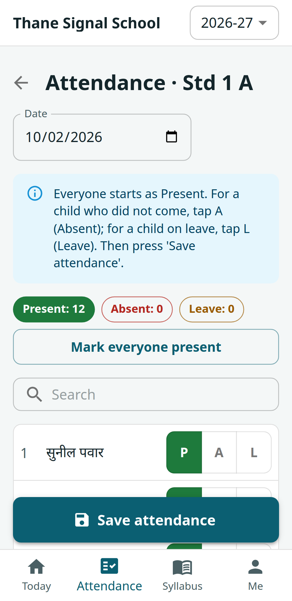
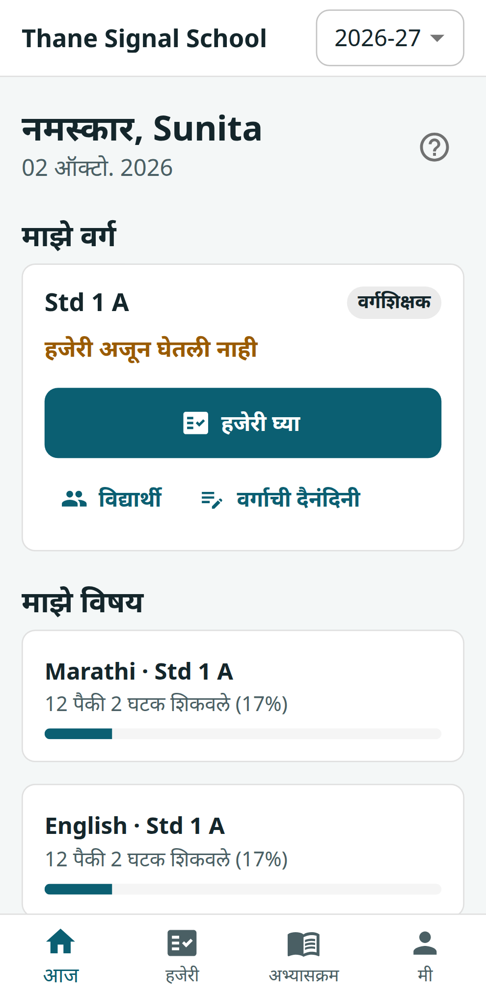
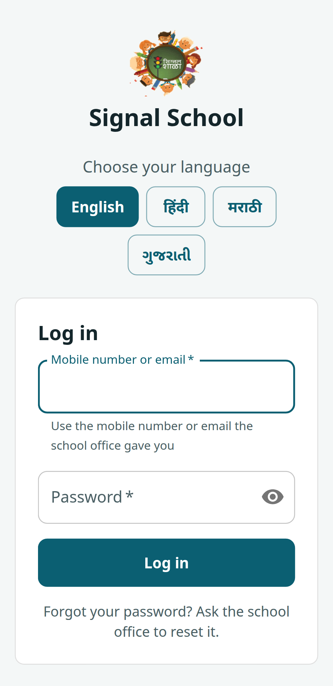

# Signal School — web app (v1)

React 19 + MUI 9 + Vite PWA for teachers and school offices of schools that teach under-privileged children. Works on
cheap phones, takes attendance offline, and speaks English / हिंदी / मराठी / ગુજરાતી. The API is in
**Signal-School-Backend**, which also holds the full documentation (`docs/`: user stories, user guide, architecture,
API, security, testing strategy, deployment).

| Attendance — one tap per child | Teacher home in Marathi | Login with language choice |
|---|---|---|
|  |  |  |

| Principal's dashboard | Child's profile |
|---|---|
|  |  |

More in [`docs/screenshots/`](docs/screenshots) (refresh with `npm run screenshots`). New here, human or AI agent?
Read [AGENTS.md](AGENTS.md) and [CONTRIBUTING.md](CONTRIBUTING.md).

## Run

```bash
cp .env.example .env      # VITE_API_URL is optional; dev proxies /api and /files to localhost:3000
npm ci
npm run dev               # http://localhost:5173 (start Signal-School-Backend first)
```

Demo logins come from the backend seed (`npm run db:seed`): `owner@demo.test`, `clerk@demo.test`, `sunita@demo.test`,
`rahul@demo.test` / `password123`.

## Checks

```bash
npm run lint              # ESLint 9 (flat config) incl. "no untranslated text in JSX"
npm test                  # Vitest: locale parity, offline queue, components, utils
npm run build
npx playwright test       # end-to-end at phone (360 px) and desktop width; needs the API running with seed data
npm run screenshots       # refresh docs/screenshots
```

## Structure

```
src/
  api/        client.js (axios, token refresh, error normalisation) · hooks.js (useGet / useSend) · session.js (shared across tabs)
  app/        AuthContext, YearContext, AppLayout (nav), routes.jsx (lazy, permission-filtered), ErrorBoundary, theme
  i18n/       index.js + locales/{en,hi,mr,gu}.json   ← every visible string lives here
  shared/     components/ (ui, fields, PhotoPicker, SectionSelect, ContactButtons…) · hooks/ · utils/ (format, permissions)
  features/   one folder per area: today, attendance (+ offline queue), students (+ leaving certificate), diary, syllabus,
              marks, health, classes, staff, years (rollover wizard), holidays, school, dashboard, audit, profile, auth
e2e/          Playwright smoke tests and journeys
```

## Conventions

- **Data:** `useGet(url, params)` / `useSend(fn, { invalidate })`. Query keys include school + academic year, so switching either refetches automatically.
- **Academic year:** the header switcher sets `X-Academic-Year`; past years render read-only (`useYear().readOnly`).
- **Permissions:** `can(role, 'perm')` in `shared/utils/permissions.js` mirrors the backend matrix (server stays the authority).
- **Text:** no literal UI strings. Add the key to `en.json` and the other three locales; `npm test` fails if any locale misses a key/placeholder or code uses an unknown key. Plurals use `_one` / `_other`. Use the words teachers use, not technical ones.
- **Layout:** MUI 9 — layout props go in `sx` (`<Stack sx={{ gap: 1 }}>`), Grid uses `size={{ xs: 12, md: 6 }}`, inputs use `slotProps`. Everything must work at 360 px wide with 44 px touch targets; wide tables scroll inside their card.
- **Errors:** the API returns `{ error: { code, fields } }`; codes map to `errors.*` / `fieldErrors.*` translations. Screens are wrapped in an error boundary.
- **Forms with server data:** `useDraft(source)` gives an editable copy that resets when the data refreshes.
- **Offline:** attendance saves to IndexedDB when offline (`features/attendance/offlineQueue.js`) and syncs on reconnect; temporary errors keep the item, refusals are shown to the user; logout clears it.
- **Printing:** register (landscape), report card and leaving certificate (`print-portrait`) use browser print, which renders Indic scripts correctly.

## Adding a feature

1. Create `src/features/<area>/<Page>.jsx`.
2. Register it in `app/routes.jsx` (with `perm`) and, if it needs a menu entry, in `NAV` in `app/AppLayout.jsx`.
3. Add strings to all four locale files.
4. Add the route for the relevant roles to `e2e/smoke.spec.js`.
